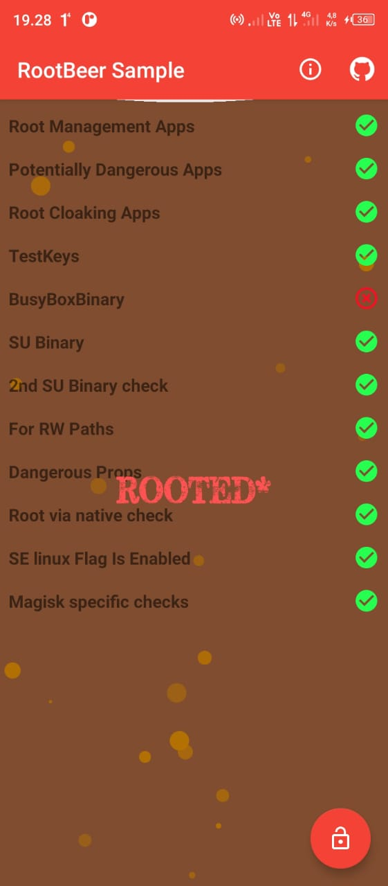
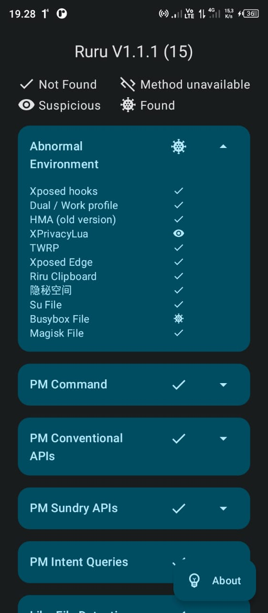
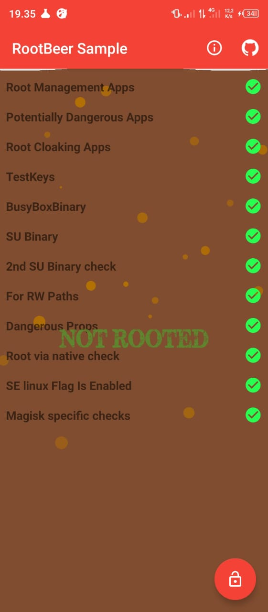
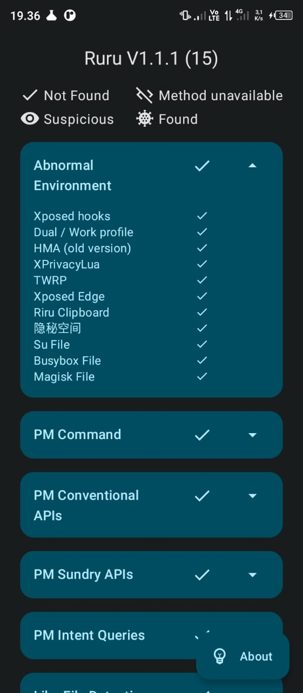

# Hide Busybox Detection - With Java and Native C/C++

**This module is used to disguise the exposed busybox, combining Java and native C/C++ for maximum results, especially for PLN Mobile applications and the like.**

# Busybox Detection Result

| Screenshot                                                     | Description                                                        |
| -------------------------------------------------------------- | ------------------------------------------------------------------ |
|  | **Before Hide** – [RootBeer](https://github.com/scottyab/rootbeer) |
|       | **Before Hide** – [Ruru](https://github.com/byxiaorun/Ruru)        |
|    | **After Hide** – [RootBeer](https://github.com/scottyab/rootbeer)  |
|         | **After Hide** – [Ruru](https://github.com/byxiaorun/Ruru)         |

## Thanks To

- [`rezadev05`](https://github.com/rezadev05)

`I would like to thank all contributors who helped create this source code.`

## Donate

## License

[MIT License](https://github.com/rezadev05/hidebusybox/LICENSE)

`Copyright (c) 2025 rezadev05`
